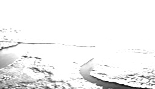

# Convolutional Neural Network

* A vanilla feed-forward neural network is usually illustrated as something below:

<p float="left">
        
    
</p>

* A convolutional neural network is illustrated very differently:

<p float="left">
        
    
</p>

* They look pretty confusing for the uninitiated--
  * Where do my lovely neurons go?
  * what do those stacked rectangular cuboids mean?

* This post will try to explain these questions by following the flow of
data from the beginning (i.e., input layer) to the end (i.e., the output layer)

## Motivation

* It is of course possible to use a vanilla FNN (e.g., a Multilayer Perceptron,
MLP) to classify images, we just flatten the image and use all the pixels as
the input layer:

<p float="left">
    
</p>

* One of the most obvious issue is that the input layer could be very big.
For example, if the image we want to classify is a 1080p image, the input
layer will have 1920 x 1080 = 2,073,600 neurons.
  * At first glance, the issue is not too big--as of 2023, GPT-4 has
  ~1,000 billion parameters. The problem is, say we a color image with
  a size of (224x244x3). The input layer in an MLP would have 150,528 neurons.
  If we then have just three modest size hidden layers with 128 neurons
  each followed by the input layer, we would exceed 300 billion trainable
  parameters in the network, which is not much smaller then GPT-4 already.

* Another probably trickier problem of MLP is that it is not "translation
invariant". This means that the network reacts differently if the main
content of the image is shifted:

<p float="left">
    
</p>


## Convolution operation

* In the context of a convolutional neural network, convolution is a
linear operation that involves the multiplication of a set of weights
with the input, much like a traditional neural network. The
multiplication is performed between an array of input data
(e.g., an image) and a two-dimensional array of weights, called a **filter**
or a **kernel**.

* The type of multiplication applied between a filter-sized patch of the
input and the filter is a dot product. A dot product is the element-wise
multiplication between the filter-sized patch of the input and filter,
which is then summed, always resulting in a single value.


* This systematic application of the *same* filter across an image is a
powerful idea. If the filter is designed to detect a specific type of
feature in the input, then the application of that filter systematically
across the entire input image allows the filter an opportunity to discover
that feature anywhere in the image.

* The result of this systematic application is a two-dimensional array of
output values that represent a filtering of the input. The two-dimensional
output array from this operation is called a "feature map".

* Once a feature map is created, we can pass each value in the feature
map through a non-linear activation function, such as a ReLU, much like
we do for the outputs of a fully connected layer.

* Just for information, technically, the convolution as described in the
use of convolutional neural networks is actually a "cross-correlation".
Nevertheless, in deep learning, it is referred to as a "convolution"
operation. Many machine learning libraries implement cross-correlation
but call it convolution.

* The idea of applying the convolutional operation to image data is not
new or unique to convolutional neural networks; it is a common technique
used in computer vision. Historically, filters were designed by hand by
computer vision experts, which hopefully makes the analysis of the image
easier in some way.

* For example, below is a hand crafted 3×3 element filter for detecting
vertical lines. Applying this filter to an image will result in a feature
map that only contains vertical lines. It is a vertical line detector.
(The effect is actually not quite obvious ¯\\_(ツ)_/¯)

```
0.0, 1.0, 0.0
0.0, 1.0, 0.0
0.0, 1.0, 0.0
```

  |  |   
:-------------------------:|:-------------------------:|:-------------------------:
Original Image | Applied Vertical Line Detector | Applied Horizontal Line Detector

## Convolutional layer

* The innovation of using the convolution operation in a neural network
is that the values of the filter are weights to be learned during the
training of the network.

* Specifically, training with stochastic gradient descent, a network is
forced to learn to extract features from the image that minimize the loss
for the specific task the network is being trained to solve, e.g. extract
features that are the most useful for classifying images as dogs or cats.

* Convolutional layers are not only applied to input data, e.g. raw pixel
values, but they can also be applied to the output of other layers. The
stacking of convolutional layers allows a hierarchical decomposition of
the input. For example, the filters that operate directly on the raw pixel
values will learn to extract low-level features, such as lines, The filters
that operate on the output of the first line layers may extract features
that are combinations of lower-level features, such as features that
comprise multiple lines to express shapes.
in fact, 

* Convolutional neural networks do not learn a single filter; they learn
multiple features in parallel for a given input. For example, it is common
for a convolutional layer to learn from 32 to 512 filters in parallel
for a given input.

* **Feature Map**: the output of one filter applied to the previous layer. A given filter is drawn across the entire previous layer, moved one pixel at a time. Each position results in an activation of the neuron and the output is collected in the feature map.

* **Stride**: The distance that filter is moved across the the input from the previous layer.
 

* **Padding**: Every time we use the filter to scan an image, the size of the image will go smaller and smaller. We don’t want that, because we wanna preserve the original size of the image to extract some low level features. Therefore, we will add some extra pixels outside the image and 
this process is called padding.

  |
:-------------------------:|:-------------------------:
No padding, output is smaller | Zero padding, output same as input | 

The distance that filter is moved across the the input from the previous layer each activation is referred to as the stride.


## Reference:
* [How Do Convolutional Layers Work in Deep Learning Neural Networks?](https://machinelearningmastery.com/convolutional-layers-for-deep-learning-neural-networks/)

* [Crash Course in Convolutional Neural Networks for Machine Learning](https://machinelearningmastery.com/crash-course-convolutional-neural-networks/)

* [Understanding Convolutional Neural Networks (CNNs): A Complete Guide](https://learnopencv.com/understanding-convolutional-neural-networks-cnn/)