# Convolutional Neural Network

* A vanilla feed-forward neural network is usually illustrated as something below:

    <p float="left">
        
        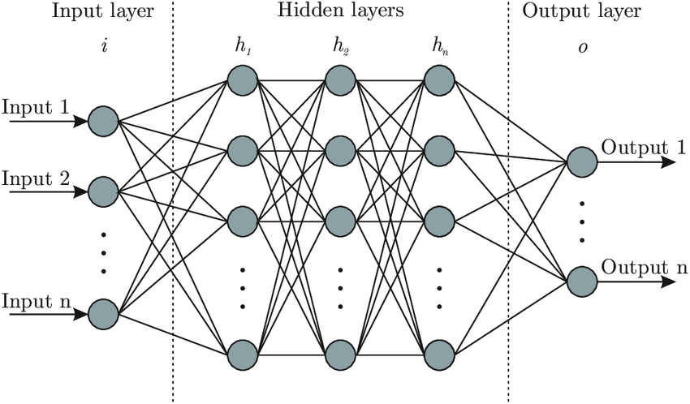
    </p>

* A convolutional neural network is illustrated very differently:

    <p float="left">
        
        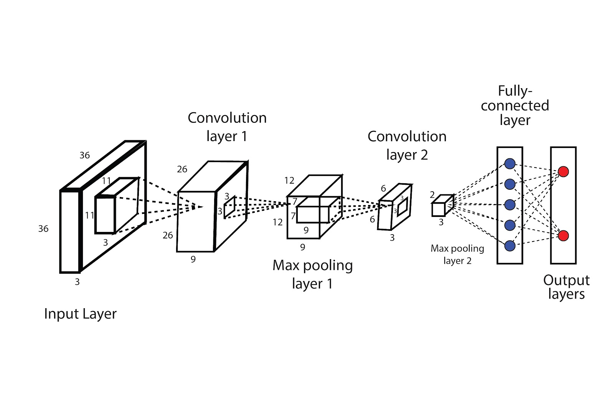
    </p>

* They look pretty confusing for the uninitiated--
  * Where do my lovely neurons go?
  * what do those stacked rectangular cuboids mean?

* This post will try to explain these questions.

## Motivation

* It is of course possible to use a vanilla FNN (e.g., a Multilayer Perceptron,
MLP) to classify images, we just flatten the image (for an image that is H
pixels in height, W pixels in width and has RGB channels, we can also say
it is a `H` by `W` by `3` *tensor*) and use all the pixels as the input layer:

    <p float="left">
        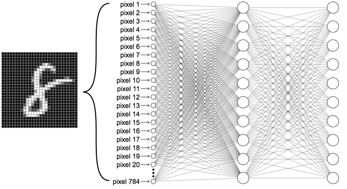
    </p>

* One of the most obvious issue is that the neural network could easily be too
big.
  * At first glance, the issue is not too big--as of 2023, GPT-4 has
  ~1,000 billion parameters. However, consider this example: say we a
  color image with a size of 224x244x3. The input layer in an MLP
  would have 150,528 neurons. If we then have just three modest
  size hidden layers with 128 neurons each followed by the input
  layer, we would exceed 300 billion trainable (150,528 * 128 * 128 * 128).
  parameters in the network, which is not much smaller then GPT-4 already.

* Another probably trickier problem of MLP is that it is not "translation
invariant". This means that the network reacts differently if the main
content of the image is shifted:

    <p float="left">
        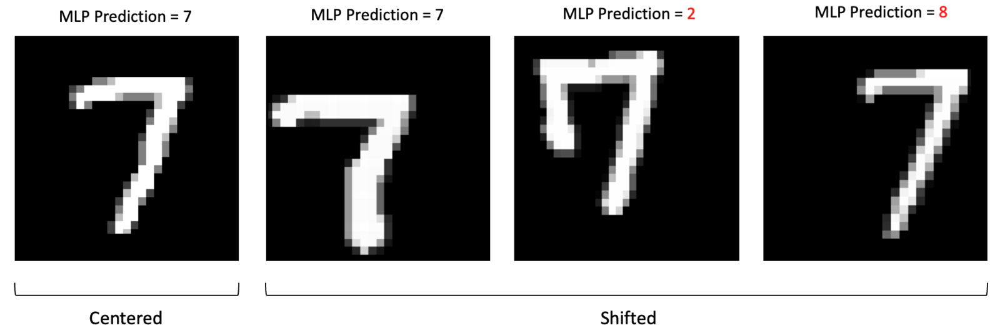
    </p>

## Overview

* At a high level, a CNN contains an upstream feature extractor followed by
a downstream classifier. Below is illustrations based on the VGG-16 CNN
model (considered to be state-of-the-art in ~2020-2021):

    <p float="left">
        <figure style="display: inline-block;">
            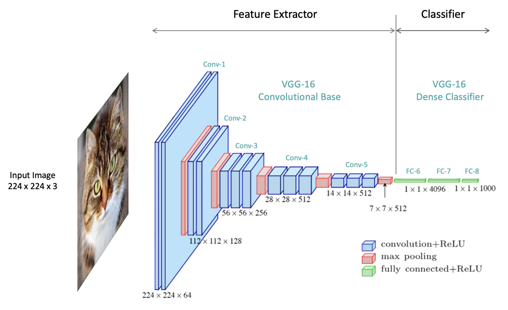
            <figcaption>
                A typical CNN diagram with feature extractor and classifier,
                but not showing densely connected layers
            </figcaption>
        </figure>
        <figure style="display: inline-block;">
            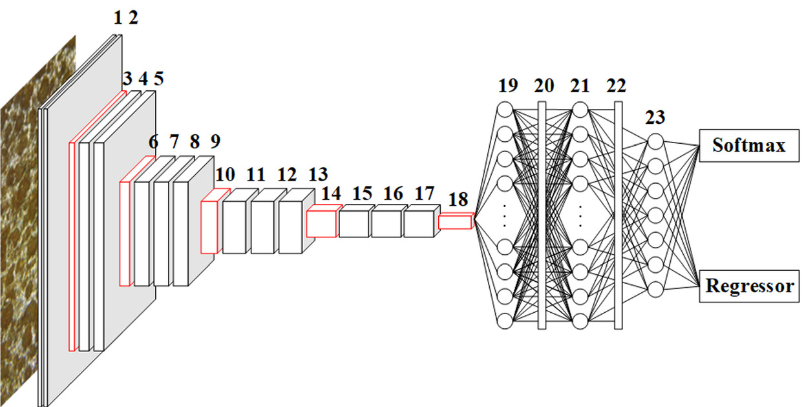
            <figcaption>CNN diagram that shows densely connected layers</figcaption>
        </figure>
    </p>

  * These two diagrams essentially show the same architecture (i.e., VGG-16),
  the right-hand side one can be less confusing as it shows the densely
  connected layers.

* The model begins with five convolutional blocks, constituting the model’s
feature extraction segment. The feature extractor is followed by the
classifier, which transforms the extracted features into class predictions
in the final output layer.

* The classifier component is very similar to a typical MLP model.

* The feature extractor component is what makes a CNN different. It usually
contains a few **convolutional blocks**. A convolutional block is the
combination of convolutional layers and pooling layers. The exact meaning
of them will be detailed in the following section.

## Convolution

* Before digging how a convolutional block/convolutional layer is designed,
we need to spend some time explaining what convolution is.

* The idea of applying the convolutional operation to image data is not
new or unique to convolutional neural networks; it is a common technique
used in computer vision. Historically, filters were designed by hand by
computer vision experts, which hopefully makes the analysis of the image
easier in some way.

* To be specific, convolution is a nothing but multiplication that is
performed between input data (which is essentially an N-dimensional array,
a.k.a., a tensor), e.g., an image, and a M-dimensional array of weights,
called a **filter** or a **kernel**.
  * For the sake of simplicity, we can now assume that both `N` and `M` are `2`.
  This simplifies the problem to matrix multiplication.

* The type of multiplication applied between a filter-sized patch of the
input and the filter/kernel is a dot product. A dot product is the element-wise
multiplication between the filter-sized patch of the input and filter/kernel,
which is then summed, always resulting in a single value.

  * The following animation shows how a 2D (6x6) matrix is convolved with a
   2D (3x3) filter/kernel:
    <p float="left">
        
    </p>

  * But what if the input is not a 2D matrix, but a 3D tensor with shape
  (6, 6, 3)? What should be the shape of the filter/kernel and what should
  be the shape of its output?

    Answer: The filter/kernel *could* be a 3 by 3 by 3 tensor and the output
    is a 4 by 4 2D array:

      <p float="left">
          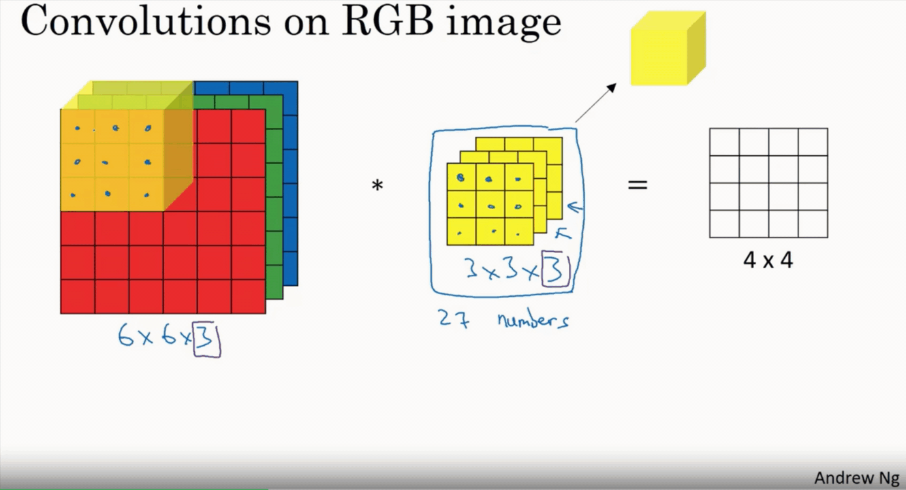
      </p>

  * Following the rule of our simpler 2D version, we do an element-wise
  dot-product, which gives us 27 values, we sum them up, move the 3d
  filter one step right, then repeat, the resultant array should be a
  4 by 4 two-dimensional array.

* The result of this systematic application is a two-dimensional array of
output values that represent a filtering of the input. The two-dimensional
output array from this operation is called a **feature map**.
  * A feature map, hopefully, extracts some useful features from the image.

* There are two more important technical details of a convolution operation:

    1. **Stride**: the distance that filter is moved across the the input from
    the previous layer. The below illustration shows the output with stride=1
    and stride=2.
      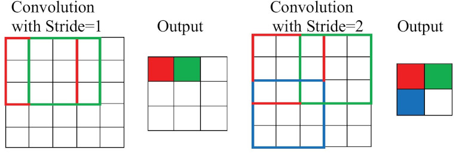

    1. **Padding**: Every time we use a filter to scan an image, the size
    of the image will go smaller and smaller. We don’t want that, because
    we wanna preserve the original size of the image to extract some low
    level features. Therefore, we will add some extra pixels outside the
    image and this process is called padding.
      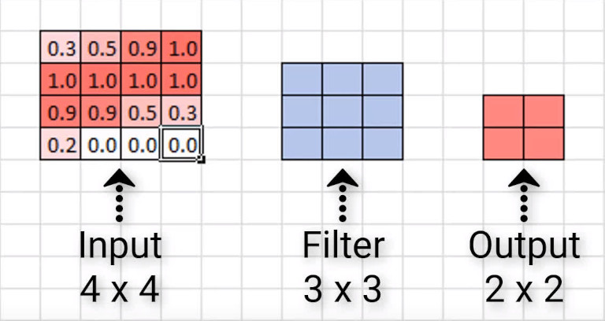  |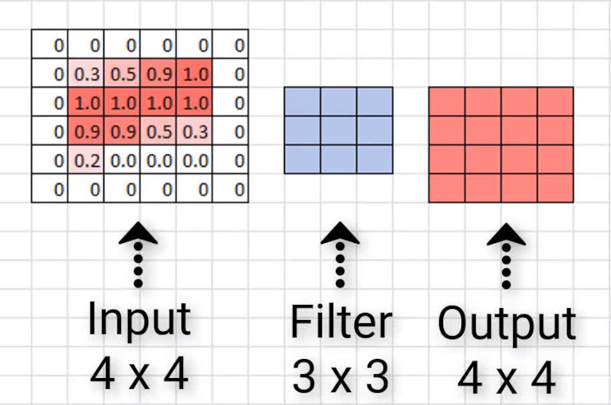|
      :-------------------------:|:-------------------------:|
      No padding, output is smaller | Zero padding, output same as input |

The distance that filter is moved across the the input from the previous layer each activation is referred to as the stride.


* Let's have a concrete example on what exactly we can see after applying
convolution. Below is a 3×3 filter called [sobel filter](https://en.wikipedia.org/wiki/Sobel_operator) used to detect edges:

    ```
    1, 0, -1
    2, 0, -2
    1, 0, -1
    ```
    * A tiny [toy project](./assets/cnn/sobel-kernel/) produces the feature map with a valve convolved with it.

  |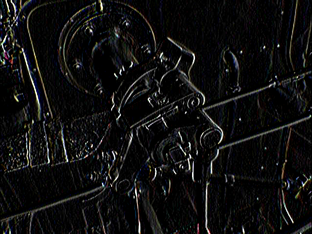 
:-------------------------:|:-------------------------:
Original Image | Convolved with Sobel kernel (a feature map)


* Once a feature map is created, we can pass each value in the feature
map through a non-linear activation function, such as a ReLU, much like
we do for the outputs of a fully connected layer.


## Architecture of CNNs

### I. Convolutional layer

* The innovation of using the convolution operation in a neural network
is that the values of the filter are weights to be learned during the
training of the network.

* Specifically, training with stochastic gradient descent (SGD), a network is
forced to learn to extract features from the image that minimize the loss
for the specific task the network is being trained to solve, e.g. extract
features that are the most useful for classifying images as dogs or cats.

* Convolutional layers are not only applied to input data, e.g. raw pixel
values, but they can also be applied to the output of other layers. The
stacking of convolutional layers allows a hierarchical decomposition of
the input. For example, the filters that operate directly on the raw pixel
values will learn to extract low-level features, such as lines, The filters
that operate on the output of the first line layers may extract features
that are combinations of lower-level features, such as features that
comprise multiple lines to express shapes.
in fact, 

* Convolutional neural networks do not learn a single filter; they learn
multiple features in parallel for a given input. For example, it is common
for a convolutional layer to learn from 32 to 512 filters in parallel
for a given input.

<p float="left">
    
</p>


## Reference

* [How Do Convolutional Layers Work in Deep Learning Neural Networks?](https://machinelearningmastery.com/convolutional-layers-for-deep-learning-neural-networks/)

* [Crash Course in Convolutional Neural Networks for Machine Learning](https://machinelearningmastery.com/crash-course-convolutional-neural-networks/)

* [Understanding Convolutional Neural Networks (CNNs): A Complete Guide](https://learnopencv.com/understanding-convolutional-neural-networks-cnn/)