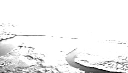

# Convolutional Neural Network

* In the context of a convolutional neural network, a convolution is a linear operation that involves the multiplication of a set of weights with the input, much like a traditional neural network. The multiplication is performed between an array of input data (e.g., an image) and a two-dimensional array of weights, called a filter or a kernel.

* The type of multiplication applied between a filter-sized patch of the input and the filter is a dot product. A dot product is the element-wise multiplication between the filter-sized patch of the input and filter, which is then summed, always resulting in a single value.


* This systematic application of the *same* filter across an image is a powerful idea. If the filter is designed to detect a specific type of feature in the input, then the application of that filter systematically across the entire input image allows the filter an opportunity to discover that feature anywhere in the image.

* The result of this systematic application is a two-dimensional array of output values that represent a filtering of the input. The two-dimensional output array from this operation is called a "feature map".

* Once a feature map is created, we can pass each value in the feature map through a non-linear activation function, such as a ReLU, much like we do for the outputs of a fully connected layer.

* Just for information, technically, the convolution as described in the use of convolutional neural networks is actually a "cross-correlation". Nevertheless, in deep learning, it is referred to as a “convolution” operation. Many machine learning libraries implement cross-correlation but call it convolution.

* The idea of applying the convolutional operation to image data is not new or unique to convolutional neural networks; it is a common technique used in computer vision. Historically, filters were designed by hand by computer vision experts, which hopefully makes the analysis of the image easier in some way.

* For example, below is a hand crafted 3×3 element filter for detecting vertical lines. Applying this filter to an image will result in a feature map that only contains vertical lines. It is a vertical line detector. (The effect is actually not quite obvious ¯\\_(ツ)_/¯)

```
0.0, 1.0, 0.0
0.0, 1.0, 0.0
0.0, 1.0, 0.0
```

  |  |   
:-------------------------:|:-------------------------:|:-------------------------:
Original Image | Applied Vertical Line Detector | Applied Horizontal Line Detector

* The innovation of using the convolution operation in a neural network is that the values of the filter are weights to be learned during the training of the network.

* Specifically, training with stochastic gradient descent, a network is forced to learn to extract features from the image that minimize the loss for the specific task the network is being trained to solve, e.g. extract features that are the most useful for classifying images as dogs or cats.

* Convolutional layers are not only applied to input data, e.g. raw pixel values, but they can also be applied to the output of other layers. The stacking of convolutional layers allows a hierarchical decomposition of the input. For example, the filters that operate directly on the raw pixel values will learn to extract low-level features, such as lines, The filters that operate on the output of the first line layers may extract features that are combinations of lower-level features, such as features that comprise multiple lines to express shapes.

## Reference:
* [How Do Convolutional Layers Work in Deep Learning Neural Networks?](https://machinelearningmastery.com/convolutional-layers-for-deep-learning-neural-networks/)