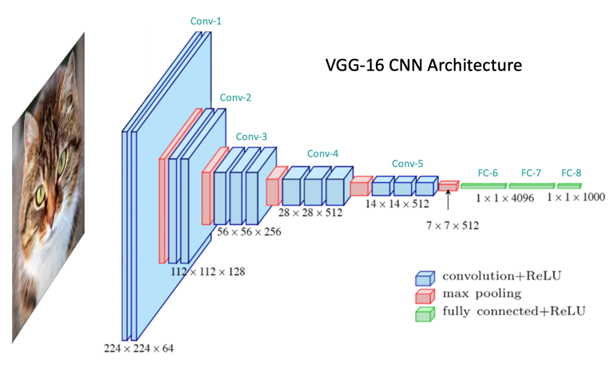
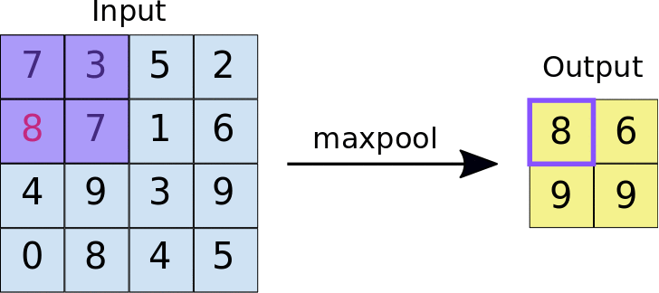

# Convolutional Neural Network

* A vanilla feed-forward neural network (FNN) is usually illustrated as
something below:

  <p float="left">
    
    
  </p>

* A convolutional neural network is illustrated very differently:

  <p float="left">
    
    
  </p>

* They look pretty confusing for the uninitiated--
  * Where do my lovely neurons go?
  * what do those stacked rectangular cuboids mean?

* This post will try to explain these questions.

## Motivation

* It is of course possible to use a vanilla FNN (e.g., a Multilayer Perceptron,
MLP) to classify images, we just flatten the image (for an image that is H
pixels in height, W pixels in width and has RGB channels, we can also say
it is a `H` by `W` by `3` *tensor*) and use all the pixels as the input layer:

    <p float="left">
        
    </p>

* One of the most obvious issue is that the neural network could easily be too
big.
  * At first glance, the issue is not too big--as of 2023, GPT-4 has
  ~1,000 billion parameters. However, consider this example: say we a
  color image with a size of 224x244x3. The input layer in an MLP
  would have 150,528 neurons. If we then have just three modest
  size hidden layers with 128 neurons each followed by the input
  layer, we would exceed 300 billion trainable (150,528 * 128 * 128 * 128).
  parameters in the network, which is not much smaller then GPT-4 already.

* Another probably trickier problem of MLP is that it is not "translation
invariant". This means that the network reacts differently if the main
content of the image is shifted:

    <p float="left">
        
    </p>

## Overview

* At a high level, a CNN contains an upstream feature extractor followed by
a downstream classifier. Below is illustrations based on the VGG-16 CNN
model (considered to be state-of-the-art in ~2020-2021):

  ||
  :-------------------------:|:-------------------------:|
  A typical CNN diagram, without explicitly showing densely connected layers | CNN diagram that also shows densely connected layers |

  * These two diagrams show the same architecture (i.e., VGG-16),
  the right-hand side can be less confusing as it shows the densely
  connected layers.

* The model begins with five convolutional blocks, constituting the model’s
feature extraction segment. The feature extractor is followed by the
classifier, which transforms the extracted features into class predictions
in the final output layer.

* The classifier component is very similar to a typical MLP model.

* The feature extractor component is what makes a CNN different. It usually
contains a few **convolutional blocks**. A convolutional block is the
combination of convolutional layers and pooling layers. The exact meaning
of them will be detailed in the following section.

## Convolution

* Before digging how a convolutional block/convolutional layer is designed,
we need to spend some time explaining what convolution is.

* The idea of applying the convolutional operation to image data is not
new or unique to convolutional neural networks; it is a common technique
used in computer vision. Historically, filters were designed by hand by
computer vision experts, which hopefully makes the analysis of the image
easier in some way.

* To be specific, convolution is a nothing but multiplication that is
performed between input data (which is essentially an N-dimensional array,
a.k.a., a tensor), e.g., an image, and a M-dimensional array of weights,
called a **filter** or a **kernel**.
  * For the sake of simplicity, we can now assume that both `N` and `M` are `2`.
  This simplifies the problem to matrix multiplication.
  * In the below figure, the filter is a matrix of:

  ```Python
   0, -1,  0, 
  -1,  5, -1,
   0, -1,  0,
  ```

  these values are called **weights**.

* The type of multiplication applied between a filter-sized patch of the
input and the filter/kernel is a dot product. A dot product is the element-wise
multiplication between the filter-sized patch of the input and filter/kernel,
which is then summed, always resulting in a single value.

  * The following animation shows how a 2D (6x6) matrix is convolved with a
   2D (3x3) filter/kernel:
    <p float="left">
        
    </p>

  * But what if the input is not a 2D matrix, but a 3D tensor with shape
  (6, 6, 3)? What should be the shape of the filter/kernel and what should
  be the shape of its output?

    Answer: The filter/kernel *could* be a 3 by 3 by 3 tensor and the output
    is a 4 by 4 2D array:

      <p float="left">
          
      </p>

  * Following the rule of our simpler 2D version, we do an element-wise
  dot-product, which gives us 27 values, we sum them up, move the 3d
  filter one step right, then repeat, the resultant array should be a
  4 by 4 two-dimensional array.

* The result of this systematic application is a two-dimensional array of
output values that represent a filtering of the input. The two-dimensional
output array from this operation is called a **feature map**.
  * A feature map, hopefully, extracts some useful features from the image.

* There are two more important technical details of a convolution operation:

    1. **Stride**: the distance that filter is moved across the the input from
    the previous layer. The below illustration shows the output (i.e., a
    feature map) with stride=1
    and stride=2.

    

    1. **Padding**: Every time we use a filter to scan an image, the size
    of the image will go smaller and smaller if the filter does not go beyond
    the boundary of the input tensor. We don’t want that. So we add some
    extra values around the original the input tensor (e.g., an image).
    This process is called padding.

      ||
    :-------------------------:|:-------------------------:|
    No padding, output is smaller | Zero padding, output same as input |

The distance that filter is moved across the the input from the previous layer each activation is referred to as the stride.

* Let's have a concrete example on what exactly we can see after applying
convolution. Below is a 3×3 filter called [sobel filter](https://en.wikipedia.org/wiki/Sobel_operator) used to detect edges:

  ```Python
  1, 0, -1
  2, 0, -2
  1, 0, -1
  ```

  * A tiny [toy project](./assets/cnn/sobel-kernel/) produces the feature map with a valve convolved with it.

  | 
:-------------------------:|:-------------------------:
Original Image | The feature map generated by Convolving the original image with Sobel kernel

## Architecture of CNNs

* The more interesting part of CNN is its feature extractor, which contains
a few convolutional blocks. A convolutional block is nothing but a convenient
term for convolutional layer and pooling layer.

### I. Convolutional layer

* The innovation of using the convolution operation in a neural network
is that the values of the filter are weights to be learned during the
training of the network.

* Specifically, training with stochastic gradient descent (SGD), a network is
forced to learn to extract features from the image that minimize the loss
for the specific task the network is being trained to solve, e.g. extract
features that are the most useful for classifying images as dogs or cats.

* Convolutional layers can not only be applied to input data, e.g. raw pixel
values, but they can also be applied to the output of other layers. The
stacking of convolutional layers allows a hierarchical decomposition of
the input. For example, the filters that operate directly on the raw pixel
values will learn to extract low-level features, such as lines, The filters
that operate on the output of the first line layers may extract features
that are combinations of lower-level features, such as features that
comprise multiple lines to express shapes.

* Convolutional neural networks do not learn a single filter; they learn
multiple features in parallel for a given input. For example, it is common
for a convolutional layer to learn from 32 to 512 filters in parallel
for a given input.

* Let's use VGG-16 as an example.

  <p float="left">
      
  </p>

* VGG-16 has five convolutional blocks. Each convolutional block contains
a few convolutional layers and one pooling layer. In this section we only
examine the convolutional layers of the first convolutional block (marked as
`Conv-1` in the above figure).

* In `Conv-1`, VGG-16 has two convolutional layers, each containing 64
filters/kernels. Programmatically, in TensorFlow/Keras, we can define them
as:

  ```Python
  model = Sequential()
  model.add(Conv2D(filters=64, kernel_size=(3, 3), padding='same', activation='relu'))
  model.add(Conv2D(filters=64, kernel_size=(3, 3), padding='same', activation='relu'))
  ```

* Previously, we say that one convolutional layer can have multiple
filters/kernels and each filter/kernel produces one feature map. In the case of
the first convolutional block of VGG-16, there are two consecutive
convolutional layers and each of them have 64 filters/kernels. So after
applying these two convolutional layers, how many feature maps do we have?
  * Answer: 64 * 64 = 4,096. Each filter/kernel in the 2nd convolutional layer
  will be convolved with each feature map produced by the 1st convolutional
  layer.

* Another interesting question is, say the first convolutional layer of VGG-16
uses 3x3 filter/kernel and  takes RGB images that are 224 by 224 in size,
how many trainable parameters are there in the 1st convolutional layer?
  * Answer: `((3 * 3 * 3) + 1)*64 = 1,792`.
  * The general formula is:
  ((The height of filter/kernel x The width of filter/kernel x Number of
  feature maps of the previous layer) + 1) x number of filters of the
  current layer. We plus one because of the bias term for each filter.
  * In this specific case, the previous layer is the input layer, it has three
  2D matrixes (e.g., one matrix for G/R/B) only.

* Applying the same logic, the 2nd convolutional layer of the 1st convolutional
block of VGG-16 has `((64 * 3 * 3) + 1) * 64 = 36,928` trainable parameters.

### II. Pooling layer

* Pooling is a downsample operation. There are two types of common pooling,
max pooling and average pooling. As an operation subsequent to convolutional
layers, pooling layer is used to downsample feature maps.

* Let's use max pooling as an example (as VGG-16 uses it only). The below
animation with pool_size `(2, 2)` and strides `(2, 2)` summarizes it all:

  <p float="left">
      
  </p>

  * Average pooling means we take average instead of the maximum value of the
  four candidate values from the feature map.

* But what purpose does pooling serve? Is it only used to reduce the amount
of computation needed?
  * Pooling is more related to the the problem that feature maps are
  sensitive to the location of the features in the input. By downsampling the
  feature map, we want to make the reduced-sized feature maps more robust to
  changes in the position of the feature in the image, referred to by
  the technical phrase "local translation invariance."

* Programmatically, we can define the maxpooling layer used in the 1st
convoluational block of VGG as follows:

  ```Python
  model.add(MaxPooling2D(pool_size=(2,2), name='max_pooling2d_1'))
  ```

## Reference

* [How Do Convolutional Layers Work in Deep Learning Neural Networks?](https://machinelearningmastery.com/convolutional-layers-for-deep-learning-neural-networks/)

* [Crash Course in Convolutional Neural Networks for Machine Learning](https://machinelearningmastery.com/crash-course-convolutional-neural-networks/)

* [Understanding Convolutional Neural Networks (CNNs): A Complete Guide](https://learnopencv.com/understanding-convolutional-neural-networks-cnn/)

* [Introduction to VGG16 | What is VGG16?](https://www.mygreatlearning.com/blog/introduction-to-vgg16/)

* [A Gentle Introduction to Pooling Layers for Convolutional Neural Networks](https://machinelearningmastery.com/pooling-layers-for-convolutional-neural-networks/)